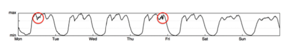
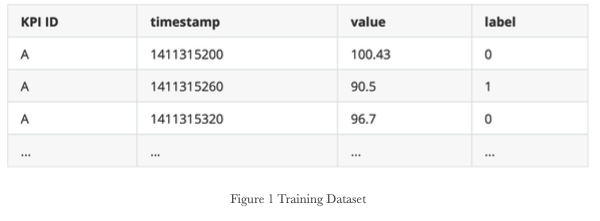
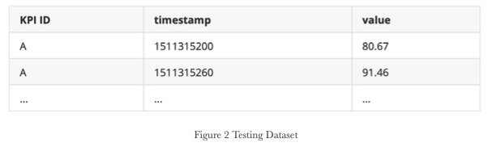
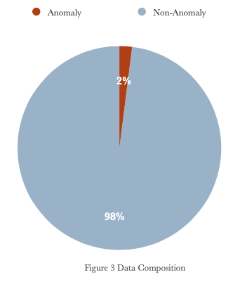
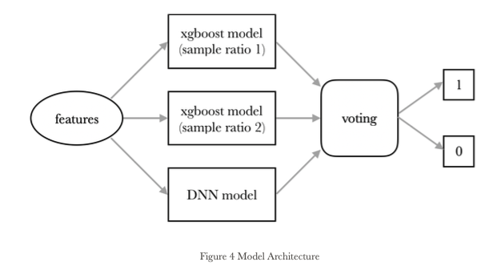
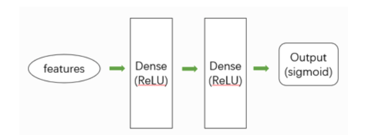

# ANM-19-project
This repository contains my project in Advanced Network Management course(Fall 2019).

**Course Homepage**: [Advanced Network Management(AIOps)](https://netman.aiops.org/courses/)

**Teacher**:[Professor Dan Pei](https://netman.aiops.org/~peidan/)

## Time Series Anomaly Detection 
### Background
To ensure undisrupted Internet-based services, such as search engines, online shopping, and social networking, large Internet companies need to closely monitor various Key Performance Indicators (KPI, e.g., Page Views, number of online users, and number of orders) to accurately detect anomalies and trigger timely troubleshooting/mitigation. The figure below shows 1-week example of PV and the red circles mark some obvious anomalies.

### Dataset
There are totally 26 different types of KPI, which have different characteristics on the time axis. About 50% of the dataset (2476315 entries totally) is used for training. As shown in Figure 1, training datasets have labels (1 for anomaly and 0 for normal). The rest is testing dataset (2345211 entries totally). There are no labels in testing datasets (Figure 2) and our task is to detect whether an anomaly happens by giving a predict label. In each KPI, all entries are sorted by time.

### Performance metric
The anomaly detection algorithm need give a predict label (0 or 1) for every observation in testing set. We use F-score on test set as the final performance metric in the ranking. In real applications, the human operators generally do not care about the point-wise metrics. It is acceptable for an algorithm to trigger an alert for any point in a contiguous anomaly segment if the delay is not too long. **For an anomaly segment with start point i, if any points between i to T + i in the ground truth were detected, we say this segment is detected correctly, and all points in this segment are treated as true positives. Otherwise, all points in this segment are regarded as false negatives.** Meanwhile, the points outside the anomaly segments are treated as usual. For example (see the figure below), when T = 1, the first anomaly segment was detected and the second segment was not, so the precision=0.75, recall=0.5. Based on the above strategy, we calculate F-score. Evaluation script can bee seen in [here](https://github.com/iopsai/iops/tree/master/evaluation).

### Goal
Design a generic anomaly detection algorithm to label the test data and get a high F-score.

### Feature Extraction
In most deep learning tasks, the goal of training a neural network is to be able to learn a lot of features of the source data. Thus, we need to extract some features from the KPI as input to the neural network. Here are the features we extracted.
 1. Time Series Value. This means the exact value of each KPI at each moment.
Obviously, it is an essential feature because it can directly reflect the current
state of software or hardware.
2. Statistical Features. We know that the KPI data have strong timing feature so
we also consider the information contained in a window. The window means the value of multiple consecutive moments. Certainly, the window size also needs to be adjusted. During a window, we calculate mean and variance.
3. Contrast Features. The comparison between two data is an important feature. We extract this feature by calculating the difference and change ratio between the adjacent moment.
4. Exponential Smoothing. The exponential smoothing method is a time series analysis and prediction method developed based on the moving average method. It calculates the exponential smoothing value and cooperates with a certain time series prediction model to predict the future of the phenomenon. Certainly, we do not use the exponential smoothing to predict the KPI because we have the KPI at each moment. However, exponential smoothing can work well in prediction task means it provides a good grasp of trends in KPI changes, which is a useful feature. Totally, we use Add Exponential Smoothing, Simple Exponential Smoothing and Holt.
5. Multiple Windows. Information contained in only one window at each moment may be not enough. Since the neural networks have strong feature learning capabilities, we try to derive other features from the above features. Specifically, we extract the above features on multiple windows of different size and calculate the difference between the features from different windows as another feature.

Finally, we get totally 128 features at each moment.

### Preprocessing
1. Normalization
* After feature extraction, we use sklearn.StandardScaler to normalize 128
features. It’s worth noting that every different KPI time series has different StandardScaler, in other words, every different KPI time series has their own mean and variance. Because every time series has different dimension, we can’t normalize their features as a whole.(Actually I tried to do that, but it seemed had bad results.)
* Base on the previous procedure, we have 26 different KPI’s normalizer(sklearn.StandardScaler). Then we use it to normalize test data’s 26 KPI time series’ features correspondingly. The reason why we don’t use the test data’s mean and variance is due to requirement that we need do same thing to train data and test data.
2. SampleRatio
* As shown in Figure 3, in the dataset, negative data (anomaly) is much less
than the positive data (non-anomaly).

 

 * Therefore, we should strengthen the weight of negative data and make their sample ratio equal to positive one. Fortunately, when training keras model or xgboost model, they all have the parameter—sample ratio which can control the weight of training data. The reason we do not use negative sampling is that we don't know where to place the generated negative data in the sequence. We think generated negative data will destroy the features of the original data in the time dimension. Besides, since the delay threshold is set as 7, in another model we focus on the first 8 anomaly point and give them much bigger sample ratio. This trick will help the model detect the anomaly faster.
  
### Model Architecture
Our model architecture is shown in Figure 4. After we did feature extraction, we trained 2 kinds of models—xgboost model and DNN model. What’s more, when training xgboost model, we use 2 different sample ratio, so we get 2 xgboost models too. Then we designed a voting method to ensemble these 3 models and do the time series anomaly detection job.

#### XGBoost Model
XGBoost, its full name is eXtreme Gradient Boosting. It’s a powerful and effective statistical model which has a lot of successful real-world applications. Most importantly, we think this model can do this anomaly detection job well.

***Filtering features***:
1. After first training, we user xgboost. XGBClassifier.feature_importances_ interface to output the features’ importance and sort them in descending order.
2. Thenwefilteredthosefeatureswhichhadlowimportanceandusethefiltered features to train our 2 xgboost model.
The reason why we did the feature filtering is because we think those features with low importance may interfere xgboost model’s training process, we only want xgboost model to focus on the important features and improve the precision.

***About 2 sample ratio***:
* Sample ratio 1: Every anomaly data has a bigger weight than non-anomaly data, and the first delay+1(7+1=8) anomaly data in every anomaly session has bigger weight than the rest anomaly data.
* Sample ratio 2: Only the first delay+1(8) anomaly data in every anomaly session has bigger weight than non-anomaly data, the rest anomaly data’s weight are same to the non-anomaly data.
The reason why we use 2 sample ratio is because we find that the first sample ratio can find more anomaly data but has a low precision but the second sample ratio has a low recall with a good precision. So we think maybe we can unite these 2 xgboost models with 2 sample ratio and improve our model’s F-score.

#### DNN Model
Besides the XGBoost-based detectors introduced above, we also present a DNN- based detector to further enhance the performance of anomaly detection. The architecture of DNN is presented in Figure 5.

Figure 5 DNN Model

For the DNN model, we implement two layers of densely connected neural networks with ReLU activation. Considering the size of the size of features is 128, the input sizes of two layers are 128 and 64 respectively. The output layer is activated with the sigmoid function.

Note that all hyperparameters above are set by a series of empirical results, but without carefully finetuning. We believe that with automatic machine learning (AutoML) techniques (e.g., hyperparameter grid-search, Bayesian optimization), the performance of our model could be further improved.

### Agressive Voting Method
Since we trained 3 models for our labeling job, so we design a voting method to combine the three results generated from the three models. Because we design a very high threshold for each model, the anomaly data points are extremely rare among all data points during every model’s detection. Therefore, our design principle here is as follow:

If there is one model in three candidates judging a point as anomaly, the data point will be labeled as an anomaly.

We name the principle above as aggressive OR voting since it resembles the OR relationship. Since the anomaly points are extremely rare, such algorithms could increase the probability of detecting anomaly points. However, the main issue of such a merging mechanism is that it may introduce many false positives. Surprisingly, from our experiments, we found that the number of false positives is acceptable and a relatively good F1-score is achieved with our model.

### Discussion
In this section, we discuss several limitations and highlight future directions of this paper.

***Hyperparameter finetuning:***
In our model, we have many hyperparameters (e.g., layer size, threshold, sampling window) to finetune. This will carry a significant barrier for network operators in practical deployment. Although finetuning hyperparameter might increase the performance, the efforts to tune are usually painstaking. The network operators could employ AutoML techniques to alleviate the efforts of parameter tuning.

***Interpretability:***
Another issue here is the problem of interpretability. Deep neural networks could easily contain thousands or even millions of parameters, whose behaviors are difficult to understand for network operators. Therefore, they usually are considered as large blackbox: take inputs, make decisions, and offer no clues why. However, network operators might not have enough confidence to deploy such blackbox models without knowing the causality. Further research efforts on the interpretable anomaly detection algorithms are left for our future work.

### Group Member
* [Bin Xiong](https://github.com/x-bin)
* [Zili Meng](https://github.com/mengzili)
* [Jihao Li](https://github.com/I4cream)